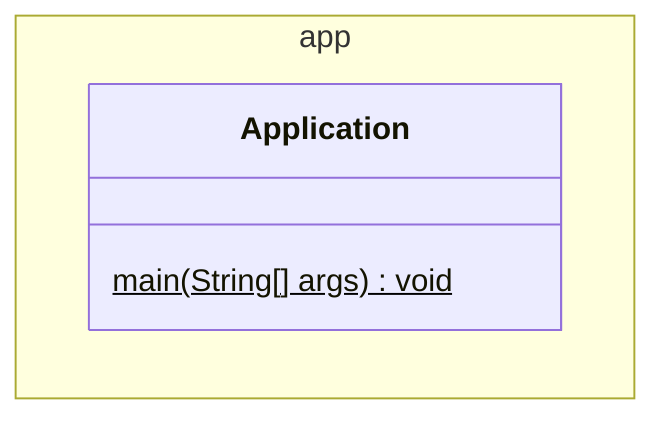
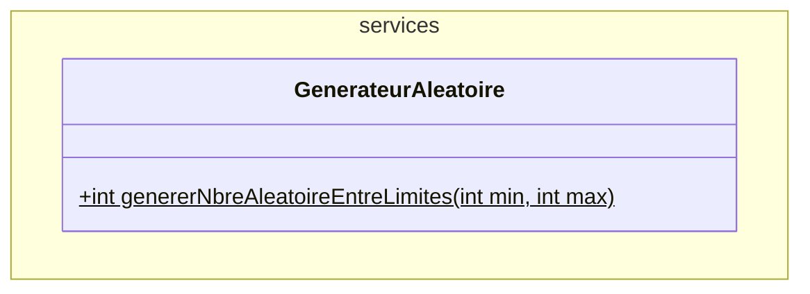
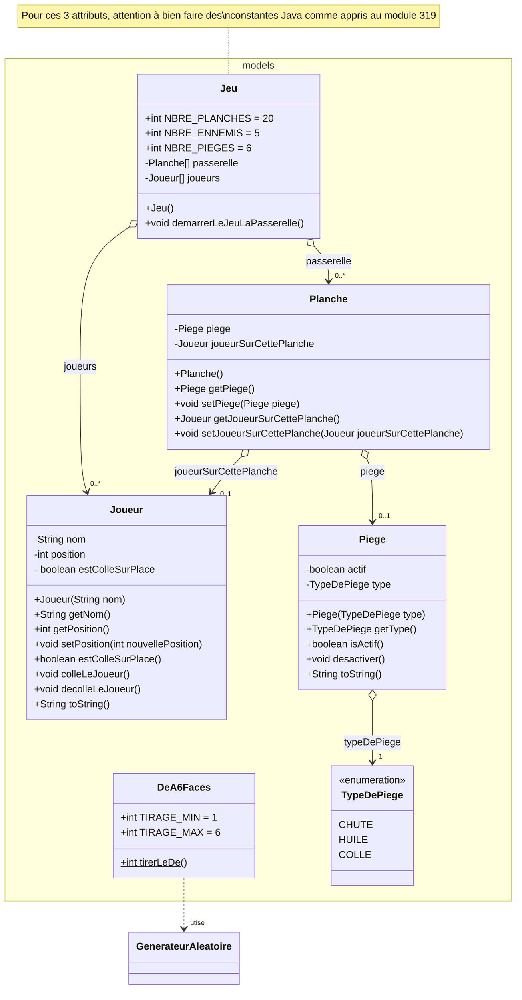

# Evaluation diagnostique N°0 : Le jeu "La Passerelle"
## Durée : 120'
## Objectifs :
L'objectif visé par cette évaluation diagnostique est de faire une _radiographie de la situation d'apprentissage de l'apprenti_.

Le but est d'identifier les sujets qui ne serait pas encore compris/maîtrisés, de déterminer le niveau d'acquisition des compétences de l'apprenant et d'identifier ses éventuelles difficultés et zones d'ombre.

Les sujets abordés dans cette évaluation diagnostique sont :
- Révision des concepts vus jusqu'ici
- Création de classes répondant à des besoins décrits
- Fabrication et utilisation d‘objets
- Communication avec ces objets et entre ces objets
- Utilisation correcte des constructeurs pour initialiser ces objets
- Compréhension du `null`
- Compréhension d'une directive donnée en partie sous forme de diagrammes UML et en partie sous forme de consignes en français  


# Mission
## Explications générales
Vous travaillez sur la réalisation d'un petit jeu vidéo en Java. Celui-ci ne fonctionne pour l'instant que sur la console.

Ce jeu multi-joueur dénommé **"La passerelle"** consiste en :
- **Un joueur** (issu de la classe `Joueur`), c'est à dire vous-même que vous pourrez créer avec le nom que vous souhaiterez lui donner.
- **Plusieurs ennemis** (également des instances de la classe `Joueur`), qui représenteront vos adversaires et qui devront être créés en respectant les indications fournies.
- **Une passerelle** composée de nombreuses **planches** (issues de la classe `Planche`) reliant les deux côtés d'une vertigineuse falaise que les joueurs vont tenter de franchir les premiers pour remporter la partie. Une planche ne peut accueillir qu'un seul joueur à la fois. Une plance peut aussi, éventuellement, être piégée.
- **Un dé**  (issu de la classe `DeA6Faces`) permettant aux joueurs de définir, tour à tour, l'avancement auquel ils auront droit sur cette passerelle.
- **Plusieurs pièges** (des instances de la classe `Piege`) qui ne fonctionneront qu'une seule fois et qui devront être créés et placés en respectant les indications données.  
Ces pièges seront toujours de 3 natures différentes (des `TypeDePiege`) :
  - `CHUTE` qui fera tomber le joueur de la passerelle. Ce joueur/ennemi sera donc mort et ne pourra gagner en réussissant à traverser la passerelle.
  - `HUILE` qui fera glisser le joueur en avant sur la passerelle tant que celui-ci ne butera pas contre d'autres joueurs présents devant lui. La glissade sera toutefois limitée à un maximum de 10 cases.
  - `COLLE` qui bloquera le joueur sur place au prochain tour, tour qu'il ne pourra donc pas effectuer.

## Démarrage du programme

Pour que le jeu "La passerelle" soit réellement démarré et correctement exécuté, il va vous falloir mettre les bonnes lignes de code Java dans votre méthode `main()`.

Pour les identifier, référez-vous au [diagramme de séquence ci-dessous](#diagramme-uml-de-séquence-de-applicationmain).

## Démarrage du jeu, déroulement et règles du jeu **"La passerelle"**

Au démarrage du `Jeu` dans sa méthode `demarrerLeJeuLaPasserelle()`, les opérations suivantes seront réalisées dans cet ordre et en respectant rigoureusement ce qui est indiqué :

1. La passerelle et ses planches seront créées. Les planches de la passerelle seront numérotées comme habituellement (de `0`, `1`, `2`, ... `NBRE_PLANCHES-1`). Toutes les planches seront créés dans un état initial simple : c'est-à-dire non occupées par un joueur et ne possédant pas de piège.

2. Les joueurs seront créés avec une position initiale à `-1`. C'est une position qui indique clairement que le joueur n'est pas encore sur une planche (car les indices des planches vont de de `0` à `NBRE_PLANCHES-1` 😉).  
Le premier des joueurs créé sera créé avec votre nom et occupera la première position dans la liste des joueurs.  
Pour les autres joueurs, donnez-leur les noms suivants : `"Terminator"`, `"Chuck Norris"`, `"Bruce Lee"`, `"Conan le barbare"` et `"Rambo"` et placez ces joueurs à la suite du votre.

3. Répétez `NBRE_PIEGES` fois l'opération suivante :

    3.1 Faire le choix aléatoire d'une planche et répéter tant que celle-ci possède déjà un piège.

    3.2 Choisir aléatoirement l'un des 3 types possibles de piège et créer ce piège, de ce type, à cette position qu'on sait être libre et mettre le piège en place sur la bonne planche de la passerelle.

4. Ensuite, répéter à jamais :  

    4.1 Pour chaque joueur présent dans la liste des joueurs

    - 4.1.1 si le joueur est collé sur place
    
        - alors le décoller

    - sinon

        - a) le joueur utilisera le savoir-faire du dé `DeA6Faces` pour déterminer son avancement propre.

        - b) si la position du joueur dépasse la dernière planche de la passerelle
        
            - alors **il sera déclaré gagnant du jeu** qui s'arrêtera (on fera un `return`). En effet, ce joueur aura réussi l'exploit de survivre à la traversée du précipice en réussissant à se rendre de l'autre côté de cette vertigineuse falaise. 

        - c) si le joueur finit sur une planche libre, c'est-à-dire qui n'est pas encore occupée par un joueur, il occupera cette position-là.

              Garder ces éléments à l'esprit lorsqu'un joueur se déplace :
              a) la position est une caractéristique du joueur => ne pas oublier de la mettre à jour
              b) la planche sur laquelle il doit aller doit être mise au courant de sa présence
              c) la planche qu'il quitte doit être mise au courant de son absence (mais achtung : seulement s'il y en avait une car n'oubliez pas qu'au départ du jeu, le joueur se trouve dans une position initiale -1 qui n'est pas une position valide sur la passerelle et qui ne correspond donc à aucune planche, il n'en quitte donc aucune dans ce cas-là 😉)

        - d) sinon si le joueur finit sur une planche déjà occupée par un autre joueur malchanceux, il échangera alors simplement sa place avec celle de ce joueur-là qui se verra brutalement rétrograder.

              Les mêmes remarques qui ci-dessus restent valables ici lorsqu'un joueur se déplace.

        - e) si la planche sur laquelle le joueur finit est munie d'un piège toujours encore actif, celui-ci se déclenchera avec 3 effets différents possibles selon le type de piège. Ensuite, ce piège sera marqué comme "utilisé" afin que celui-ci ne puisse plus se déclencher à nouveau. Pour rappel, en fonction du type de piège, voici ce qui doit se passer :
            - `CHUTE`, un effet dramatique : le joueur tombe de la passerelle et sera déclaré mort. Pour obtenir ce comportement, il faudra tout simplement le faire disparaître de la liste des joueurs (et c'est tout simplement ainsi qu'il n'aura tout simplement plus l'opportunité de jouer 😉).

            - `COLLE`, un effet négatif :  le joueur sur la planche restera collé sur place au prochain tour, tour qu'il ne pourra donc pas effectuer. Pour réaliser cela, il suffit d'indiquer cela dans l'état du joueur concerné.  

            - `HUILE`, un effet super positif :  le joueur va glisser en avant sur les planches de la passerelle tant qu'il ne butera pas contre un autre joueur présent devant lui, mais il glissera d'au maximum de 10 cases.
            
                **✋⛔️ NE PAS IMPLEMENTER LE COMPORTEMENT `HUILE` CI-DESSUS.**
                  Ne le faire que si tout le reste a été fait tip-top et que ça fonctionne (inutile pour comprendre où vous en êtes avec cette matière).  
                  Cette fonctionnalité sera réalisée après le corrigé en commun de cette évaluation diagnostique. Vous aurez l'occasion de corriger votre travail et y apporter cette fonctionnalité supplémentaire, sous forme d'exercice cette fois-ci.
        
    - N.B. Toutes les opérations réalisées dans l'ensemble du pt 4.1 seront affichées de manière lisible sur la console afin qu'on puisse voir l'évolution du jeu. Consulter l'exemple fourni ci-dessous pour savoir comment formater l'affichage sur la console.

## Diagrammes UML fournis
### Diagramme UML des classes du package `app`
Vous trouverez ci-dessous toutes les indications nécessaires pour réaliser la carcasse des classes de votre application ainsi que pour leur donner les fonctionnalités désirées.

Pour l'implémentation précise de ces fonctionnalités, référez-vous aux descriptions fournies ci-dessus, respectivement aux autres diagrammes UML fournis.


### Diagramme UML des classes du package `services`
Vous trouverez ci-dessous toutes les indications nécessaires pour réaliser la carcasse des classes de votre application ainsi que pour leur donner les fonctionnalités désirées.

Pour l'implémentation précise de ces fonctionnalités, référez-vous aux descriptions fournies ci-dessus, respectivement aux autres diagrammes UML fournis.


### Diagramme UML des classes du package `models`
Vous trouverez ci-dessous toutes les indications nécessaires pour réaliser la carcasse des classes de votre application ainsi que pour leur donner les fonctionnalités désirées.

Pour l'implémentation précise de ces fonctionnalités, référez-vous aux descriptions fournies ci-dessus, respectivement aux autres diagrammes UML fournis.



### Diagramme UML de séquence de Application.main()

```mermaid
---
title: Diagramme de séquence de Application.main()
---
sequenceDiagram
    main()->>System.out : println("Le jeu va débuter...")
    create participant Jeu jeu
    main()-->>Jeu jeu : <<creation>>
    main()->>+Jeu jeu : demarrerLeJeuLaPasserelle()
    main()->>System.out : println("Le jeu est terminé !")
```


## Affichage sur la console
Voici quelques résultats de parties affichées sur la console, afin que vous compreniez ce que vous devez afficher :

**Partie 1**
```
Le jeu va débuter...
 - Un piège COLLE est posé sur la planche N°11
 - Un piège COLLE est posé sur la planche N°8
 - Un piège CHUTE est posé sur la planche N°0
 - Un piège HUILE est posé sur la planche N°3
 - Un piège HUILE est posé sur la planche N°15
 - Un piège COLLE est posé sur la planche N°14
'Paul' tire un 4
'Paul' se déplace sur la planche N°3
'Paul' se déplace sur une planche HUILEE :-)
'Paul' glisse de 10 planches.
'Paul' se retrouve sur la planche N°13
'Terminator' tire un 2
'Terminator' se déplace sur la planche N°1
'Chuck Norris' tire un 1
'Chuck Norris' se déplace sur la planche N°0
'Chuck Norris' se déplace sur une planche piégée et CHUTE !!!
'Bruce Lee' tire un 5
'Bruce Lee' se déplace sur la planche N°4
'Conan le barbare' tire un 4
'Conan le barbare' se déplace sur la planche N°3 et échange se place avec 'Paul'
'Rambo' tire un 6
'Rambo' se déplace sur la planche N°5
'Paul' tire un 5
'Paul' se déplace sur la planche N°4 et échange se place avec 'Bruce Lee'
'Terminator' tire un 2
'Terminator' se déplace sur la planche N°3 et échange se place avec 'Conan le barbare'
'Bruce Lee' tire un 1
'Bruce Lee' se déplace sur la planche N°0 et échange se place avec 'Chuck Norris'
'Conan le barbare' tire un 3
'Conan le barbare' se déplace sur la planche N°4 et échange se place avec 'Paul'
'Rambo' tire un 1
'Rambo' se déplace sur la planche N°6
'Paul' tire un 5
'Paul' se déplace sur la planche N°6 et échange se place avec 'Rambo'
'Terminator' tire un 6
'Terminator' se déplace sur la planche N°9
'Bruce Lee' tire un 1
'Bruce Lee' se déplace sur la planche N°1 et échange se place avec 'Rambo'
'Conan le barbare' tire un 1
'Conan le barbare' se déplace sur la planche N°5
'Rambo' tire un 2
'Rambo' se déplace sur la planche N°2
'Paul' tire un 5
'Paul' se déplace sur la planche N°11
'Paul' se déplace sur planche piégée et sera COLLE au prochain tour !
'Terminator' tire un 6
'Terminator' se déplace sur la planche N°15
'Terminator' se déplace sur une planche HUILEE :-)
'Terminator' glisse de 4 planches.
'Terminator' se retrouve sur la planche N°19
'Bruce Lee' tire un 1
'Bruce Lee' se déplace sur la planche N°2 et échange se place avec 'Rambo'
'Conan le barbare' tire un 3
'Conan le barbare' se déplace sur la planche N°8
'Conan le barbare' se déplace sur planche piégée et sera COLLE au prochain tour !
'Rambo' tire un 4
'Rambo' se déplace sur la planche N°5
'Paul' se décolle de la planche N°11
'Terminator' tire un 6
'Terminator' gagne la partie !!!
Le jeu est terminé !
```

**Partie 2**
```
Le jeu va débuter...
 - Un piège CHUTE est posé sur la planche N°7
 - Un piège HUILE est posé sur la planche N°0
 - Un piège HUILE est posé sur la planche N°2
 - Un piège HUILE est posé sur la planche N°18
 - Un piège CHUTE est posé sur la planche N°8
 - Un piège COLLE est posé sur la planche N°19
'Paul' tire un 6
'Paul' se déplace sur la planche N°5
'Terminator' tire un 4
'Terminator' se déplace sur la planche N°3
'Chuck Norris' tire un 3
'Chuck Norris' se déplace sur la planche N°2
'Chuck Norris' se déplace sur une planche HUILEE :-)
'Chuck Norris' glisse de 0 planches.
'Chuck Norris' se retrouve sur la planche N°2
'Bruce Lee' tire un 2
'Bruce Lee' se déplace sur la planche N°1
'Conan le barbare' tire un 2
'Conan le barbare' se déplace sur la planche N°1 et échange se place avec 'Bruce Lee'
'Rambo' tire un 3
'Rambo' se déplace sur la planche N°2 et échange se place avec 'Chuck Norris'
'Paul' tire un 4
'Paul' se déplace sur la planche N°9
'Terminator' tire un 2
'Terminator' se déplace sur la planche N°5
'Chuck Norris' tire un 2
'Chuck Norris' se déplace sur la planche N°1 et échange se place avec 'Conan le barbare'
'Bruce Lee' tire un 6
'Bruce Lee' se déplace sur la planche N°5 et échange se place avec 'Terminator'
'Conan le barbare' tire un 3
'Conan le barbare' se déplace sur la planche N°2 et échange se place avec 'Rambo'
'Rambo' tire un 3
'Rambo' se déplace sur la planche N°2 et échange se place avec 'Conan le barbare'
'Paul' tire un 5
'Paul' se déplace sur la planche N°14
'Terminator' tire un 5
'Terminator' se déplace sur la planche N°4
'Chuck Norris' tire un 2
'Chuck Norris' se déplace sur la planche N°3
'Bruce Lee' tire un 4
'Bruce Lee' se déplace sur la planche N°9
'Conan le barbare' tire un 3
'Conan le barbare' se déplace sur la planche N°2 et échange se place avec 'Rambo'
'Rambo' tire un 5
'Rambo' se déplace sur la planche N°4 et échange se place avec 'Terminator'
'Paul' tire un 2
'Paul' se déplace sur la planche N°16
'Terminator' tire un 5
'Terminator' se déplace sur la planche N°4 et échange se place avec 'Rambo'
'Chuck Norris' tire un 6
'Chuck Norris' se déplace sur la planche N°9 et échange se place avec 'Bruce Lee'
'Bruce Lee' tire un 2
'Bruce Lee' se déplace sur la planche N°5
'Conan le barbare' tire un 2
'Conan le barbare' se déplace sur la planche N°4 et échange se place avec 'Terminator'
'Rambo' tire un 6
'Rambo' se déplace sur la planche N°5 et échange se place avec 'Bruce Lee'
'Paul' tire un 1
'Paul' se déplace sur la planche N°17
'Terminator' tire un 5
'Terminator' se déplace sur la planche N°7
'Terminator' se déplace sur une planche piégée et CHUTE !!!
'Chuck Norris' tire un 5
'Chuck Norris' se déplace sur la planche N°14
'Bruce Lee' tire un 2
'Bruce Lee' se déplace sur la planche N°1
'Conan le barbare' tire un 5
'Conan le barbare' se déplace sur la planche N°9
'Rambo' tire un 2
'Rambo' se déplace sur la planche N°7 et échange se place avec 'Terminator'
'Paul' tire un 2
'Paul' se déplace sur la planche N°19
'Paul' se déplace sur planche piégée et sera COLLE au prochain tour !
'Chuck Norris' tire un 5
'Chuck Norris' se déplace sur la planche N°19 et échange se place avec 'Paul'
'Bruce Lee' tire un 2
'Bruce Lee' se déplace sur la planche N°3
'Conan le barbare' tire un 3
'Conan le barbare' se déplace sur la planche N°12
'Rambo' tire un 5
'Rambo' se déplace sur la planche N°12 et échange se place avec 'Conan le barbare'
'Paul' se décolle de la planche N°14
'Chuck Norris' tire un 5
'Chuck Norris' gagne la partie !!!
Le jeu est terminé !
```

**Partie 3**
```
Le jeu va débuter...
 - Un piège HUILE est posé sur la planche N°17
 - Un piège CHUTE est posé sur la planche N°0
 - Un piège CHUTE est posé sur la planche N°6
 - Un piège CHUTE est posé sur la planche N°8
 - Un piège CHUTE est posé sur la planche N°2
 - Un piège CHUTE est posé sur la planche N°15
'Paul' tire un 1
'Paul' se déplace sur la planche N°0
'Paul' se déplace sur une planche piégée et CHUTE !!!
'Terminator' tire un 3
'Terminator' se déplace sur la planche N°2
'Terminator' se déplace sur une planche piégée et CHUTE !!!
'Chuck Norris' tire un 6
'Chuck Norris' se déplace sur la planche N°5
'Bruce Lee' tire un 2
'Bruce Lee' se déplace sur la planche N°1
'Conan le barbare' tire un 5
'Conan le barbare' se déplace sur la planche N°4
'Rambo' tire un 1
'Rambo' se déplace sur la planche N°0 et échange se place avec 'Paul'
'Chuck Norris' tire un 5
'Chuck Norris' se déplace sur la planche N°10
'Bruce Lee' tire un 6
'Bruce Lee' se déplace sur la planche N°7
'Conan le barbare' tire un 1
'Conan le barbare' se déplace sur la planche N°5
'Rambo' tire un 6
'Rambo' se déplace sur la planche N°6
'Rambo' se déplace sur une planche piégée et CHUTE !!!
'Chuck Norris' tire un 5
'Chuck Norris' se déplace sur la planche N°15
'Chuck Norris' se déplace sur une planche piégée et CHUTE !!!
'Bruce Lee' tire un 3
'Bruce Lee' se déplace sur la planche N°10
'Conan le barbare' tire un 6
'Conan le barbare' se déplace sur la planche N°11
'Bruce Lee' tire un 4
'Bruce Lee' se déplace sur la planche N°14
'Conan le barbare' tire un 4
'Conan le barbare' se déplace sur la planche N°15 et échange se place avec 'Chuck Norris'
'Bruce Lee' tire un 6
'Bruce Lee' gagne la partie !!!
Le jeu est terminé !
```
# Restitution
Lorsque vous êtes prêt, faites un `commit` de votre travail.

Vous demanderez préalablement l'autorisation au prof avant de remettre le réseau et de faire un `push` sur votre repository github-classroom.

# Exercice
Cette évaluation diagnostique a été réalisée en classe, vous vous y êtes confrontés, vous l'avez faite et rendue et celle-ci a ensuite été corrigée en classe par le prof.

Vous allez maintenant pouvoir apporter les corrections nécessaires à votre projet pour qu'il fonctionne comme prévu.

**✋⛔️ATTENTION** ce point est vraiment crucial :

     A l'évidence on comprend toujours beaucoup plus facilement face à l'écran du voisin ou celui du prof qui explique, que seul face à son propre écran confronté seul au problème à résoudre.
     
     S'assurer d'avoir 'réellement' compris consiste donc à distinguer entre 'croire d'avoir compris' et 'savoir avoir compris'.
     
     Pour cela une seule solution : se prouver être capable de le faire seul, sans aide extérieure, et ainsi réellement distinguer entre le 'je pense avoir compris mes erreurs' lors de la correction en plénum en classe avec le 'j'ai réellement compris mes erreurs' en réussissant à effectivement les corriger, seul face à celles-ci.

Une fois vos erreurs corrigées, réalisez cette fois-ci l'action HUILE telle que décrite.
